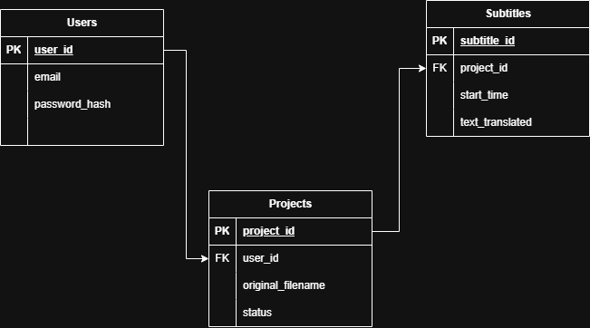

# SubFlick AI - Context-Aware Subtitle Generator

A SaaS application that automates video localization using a hybrid AI architecture. It combines local GPU processing for precision timestamps with Cloud LLMs for cultural context.

## 🏗 Architecture

## 🚀 Tech Stack

- **Backend:** FastAPI (Python)
- **Database:** PostgreSQL (Relational Data Modeling)
- **Authentication:** OAuth2 / JWT
- **AI Processing (Hybrid Strategy):**
  - **ASR (The Ear):** OpenAI Whisper (Running locally via PyTorch) for zero-latency transcription.
  - **Translation (The Brain):** Google Gemini Pro (via API) for context-aware and slang-accurate translation.

## ⚙️ Features

- **Smart Transcription:** Extracts audio and generates precise timestamps.
- **Contextual Translation:** Understands the difference between literal meanings and cultural idioms.
- **Privacy Focused:** Auto-deletes user media after processing.
